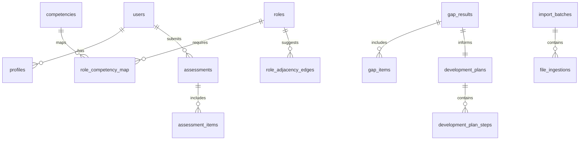

# Modules and Schema

## Overview
This document describes the canonical schema that underpins the MVP Career Platform. It focuses on entities for roles, competencies, mappings, assessments, gaps, plans, adjacency, audit, and traceability.

## Core Tables (Proposed)
- roles(id PK, name UNIQUE, description, version, source)
- competencies(id PK, name UNIQUE, definition)
- role_competency_map(role_id, competency_id, required_min_level, required_max_level, PRIMARY KEY(role_id, competency_id))
- users(id PK, email UNIQUE, name)
- profiles(id PK, user_id FK→users.id, current_role_id FK→roles.id, target_role_id FK→roles.id, updated_at)
- assessments(id PK, user_id FK→users.id, created_at)
- assessment_items(assessment_id, competency_id, level, PRIMARY KEY(assessment_id, competency_id))
- gap_results(id PK, user_id FK→users.id, target_role_id FK→roles.id, created_at)
- gap_items(gap_result_id, competency_id, current_level, required_min_level, required_max_level, PRIMARY KEY(gap_result_id, competency_id))
- development_plans(id PK, gap_result_id FK→gap_results.id, created_at, export_link)
- development_plan_steps(plan_id, sequence, description, action_type, resource, PRIMARY KEY(plan_id, sequence))
- role_adjacency_edges(from_role_id, to_role_id, weight, rationale, PRIMARY KEY(from_role_id, to_role_id))
- templates(id PK, name UNIQUE, content, metadata JSONB)
- audit_logs(id PK, timestamp, user_id, action, entity_type, entity_id, details JSONB)
- import_batches(id PK, created_at, source, notes)
- file_ingestions(id PK, batch_id FK→import_batches.id, file_path, checksum, status, errors JSONB, row_count)
- traceability(entity_type, entity_id, source_documents JSONB, PRIMARY KEY(entity_type, entity_id))

### Mermaid ERD (proposed)

## Constraints and Indexes
- ENUM for proficiency: F, P, A, Au (or domain with CHECK).
- Unique constraints: roles(name, version), competencies(name).
- Indexes: role_competency_map(role_id, competency_id), role_adjacency_edges(weight), gap_results(user_id, target_role_id, created_at DESC), audit_logs(timestamp DESC).

## Data Consistency
- ON DELETE CASCADE for child tables tied to assessments, gap results, and plan steps.
- All writes recorded in audit_logs with a consistent actor and traceId.
- traceability rows maintained by ingestion pipelines and write paths.

## Import and Versioning
- Each import run creates an import_batches row with source and notes.
- Each file creates a file_ingestions row with checksum and validation results.
- role_competency_map changes are versioned via roles.version and traceability source_documents.
